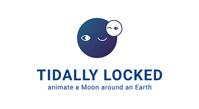

## What is this?

Tidally Locked is a visual simulator for the phenomenon known as tidal locking which occurs between two astronomical bodies.

### What is tidal Locking?

> Tidal locking (also called gravitational locking, captured rotation and spin–orbit locking), in the best-known case, occurs when an orbiting astronomical body always has the same face toward the object it is orbiting. This is known as synchronous rotation: the tidally locked body takes just as long to rotate around its own axis as it does to revolve around its partner. For example, the same side of the Moon always faces the Earth, although there is some variability because the Moon's orbit is not perfectly circular. Usually, only the satellite is tidally locked to the larger body.[1] However, if both the difference in mass between the two bodies and the distance between them are relatively small, each may be tidally locked to the other; this is the case for Pluto and Charon.
>
> -- <cite>[Wikipedia 'Tidal Locking'][1]</cite>

[1]: https://en.wikipedia.org/wiki/Tidal_locking

### How do I use this?

This web app was made in hopes of illustrating how the alignment of the Moon's rotational period with the orbital period results in the Moon perpetually facing the Earth. In the control panel, you can adjust the rotational period (the amount of time it takes for the moon to rotate once on it's own axis) and the orbital period (the amount the time it takes for the moon to rotate around the Earth once) and see whether the little triangle (consider it to be the 'nose' on one face of the moon) faces or doesn't face the Earth. When it is always facing the Earth, you will be able to see a thin red line that indicates that the two bodies are tidally locked. Imagine standing anywhere on that Earth, and you will only be able to see the 'nose' side of the Moon.

## How is it made?

It is built on React, bootstrapped with [Create React App](https://github.com/facebook/create-react-app). Components are separated into Layout (Header, Footer), Interface (where the control-y things are), Viewer (where the planet and moon animate) subcomponents. The main animated parts are built on styled components that take in props for the rotational period, orbital period, orbit radius, etc. I have a couple of making-of [blog posts](https://weiji.io/2020/02/23/tidally-locked/), but it is written in Korean.

## Issues I'm still dealing with...

I know there's some refactoring to do... I'd like to get immer and context API involved. (still learning!) And I've written one of the styled components inside the render method (which is a BIG NONO, performance wise) - I did this to aovid animations keyframes caching and not reflecting state changes properly. I'm sure there's some better solution.

## Can I use it?

Yes! I'd love for anyone to get use out of this. (I hope somewhat educational?) Ideally SPACE-ducational! If you see some other use for the animated components or any other parts of this application, you can clone and tweak it to make something else cool, that'd be nice too.

Okay, bye!
